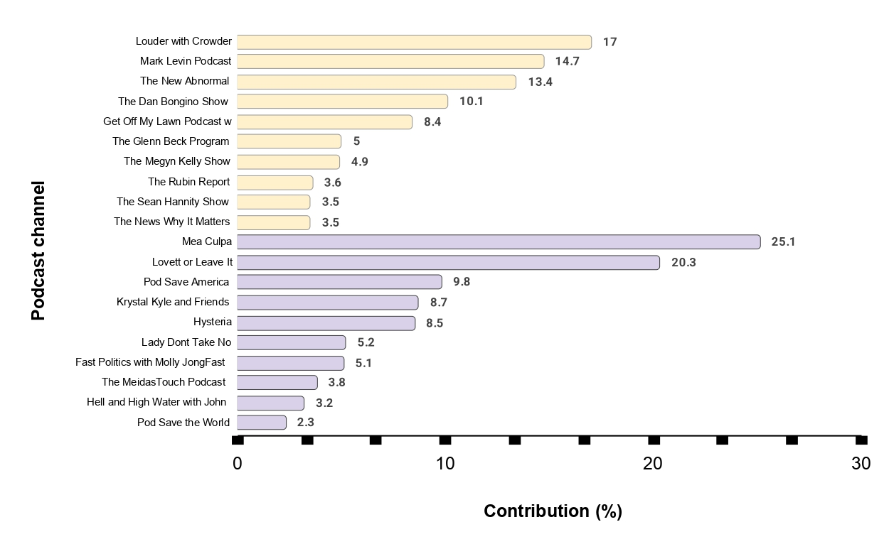

# Toxicity Begets Toxicity: Unraveling Conversational Chains in Political Podcasts

Accepted at **ACM Multimedia 2025**

Naquee Rizwan, Nayandeep Deb, Sarthak Roy, Vishwajeet Singh Solanki, Kiran Garimella, Animesh Mukherjee:
[[Arxiv]](https://arxiv.org/abs/2501.12640) -- **Full updated paper with main content + Appendix will be soon available on Arxiv.**

------------------------------------------
## Abstract
Tackling toxic behavior in digital communication continues to be a pressing concern for both academics and industry professionals. While significant research has explored toxicity on platforms like social networks and discussion boards, podcasts—despite their rapid rise in popularity—remain relatively understudied in this context. This work seeks to fill that gap by curating a dataset of political podcast transcripts and analyzing them with a focus on conversational structure. Specifically, we investigate how toxicity surfaces and intensifies through sequences of replies within these dialogues, shedding light on the organic patterns by which harmful language can escalate across conversational turns.

------------------------------------------
## Dataset

The **top 100 toxic conversation chains** and their **ground truth cpd annotations**, each for conservative and liberal 
podcast channels are present in this GitHub repository itself [[**cpd/dataset**]](https://github.com/hate-alert/ToxicityBegetsToxicity-Audio/tree/main/cpd/dataset). This folder contains:
- two annotation **_csv files_** (one each for conservatives and liberals) containing annotations of individual 
  annotators (ex: Annotator_ND) and based on the majority voting as well (refer 'Inter_Annotator'). Further, this 
  file also contains the cpd results as predicted by traditional CPD algorithms (refer [[**ruptures**]](https://centre-borelli.github.io/ruptures-docs/) library).
- two **_json files_** (one each for conservatives and liberals) containing the details of top 100 toxic conversation 
  chains.

------------------------------------------
## Hugging Face

Additionally, we also provide the [[**Hugging Face**]](https://huggingface.co/datasets/nrizwan/toxicity_begets_toxicity_conversational_chains/tree/main) dataset with:
- **audio clips** _(.wav files)_ of top 100 toxic conversation chains (for both conservatives and liberals). These 
  files are required to run the audio prompts in [[**cpd/dataset/audio_prompt_cpd.py**]](https://github.com/hate-alert/ToxicityBegetsToxicity-Audio/blob/main/cpd/audio_prompt_cpd.py). **Note-** Please accordingly 
  update the path to folders to make the code working.
- **all toxic conversation chains** from both, conservative and liberal podcast channels. As stated in the paper, we 
  define a toxic conversation chain whose toxicity value is greater than 0.7.
- **complete diarized dataset** with toxicity scores calculated using Perspective API for both conservative and 
  liberal podcast channels.

------------------------------------------
## Appendix

ACM MM 2025 did not have the provision of incorporating supplementary material. Hence, we provide it [[**here**]](https://github.com/hate-alert/ToxicityBegetsToxicity-Audio/blob/main/Appendix.pdf).

------------------------------------------
## Snippets from paper

#### Schema of conversation chain

  

**Top:** Computation of segments from chunks and their contents. **Bottom**: Schema for toxic conversation chains. 
The segment marked in red color represents the anchored segment with toxicity above a threshold of 0.7.

------------------------------------------
#### Examples of chains

  
  

  
Since it is not feasible to illustrate all segments, one among the previous and next segments is shown 
along with the anchor segment from the toxic conversation chain. Toxic texts in the anchor segment are marked in red 
color. **Note:** start and end times are in seconds.

------------------------------------------

#### Toxicity begets toxicity

  
  

  
Using conversational chains to identify and predict the toxicity trends using change point detection algorithms. 
**Plots** representing two samples comparing human annotation with **GPT-4o-Audio** zero-shot setup's detected change points. Correctly predicted points are marked with a **red hexagon** and incorrect predictions are marked with **red cross.**

------------------------------------------

#### Podcast Statistics

  
  

**Left:** Top 10 podcast shows with most amount of toxic content for each leaning, i.e. right and left. The bars 
show the percentage of episodes containing at least one toxic conversation. **Right:** Distribution of toxic 
conversation chains across the podcast channels for each leaning, i.e. right and left. Percentage contribution for Top 10 podcast channels are shown.

------------------------------------------
## Please cite our paper

~~~bibtex
@misc{rizwan2025dynamicstoxicitypoliticalpodcasts,
      title={Dynamics of Toxicity in Political Podcasts}, 
      author={Naquee Rizwan and Nayandeep Deb and Sarthak Roy and Vishwajeet Singh Solanki and Kiran Garimella and Animesh Mukherjee},
      year={2025},
      eprint={2501.12640},
      archivePrefix={arXiv},
      primaryClass={cs.CL},
      url={https://arxiv.org/abs/2501.12640}, 
}
~~~

------------------------------------------
## Contact
For any questions or issues, please contact: nrizwan@kgpian.iitkgp.ac.in
